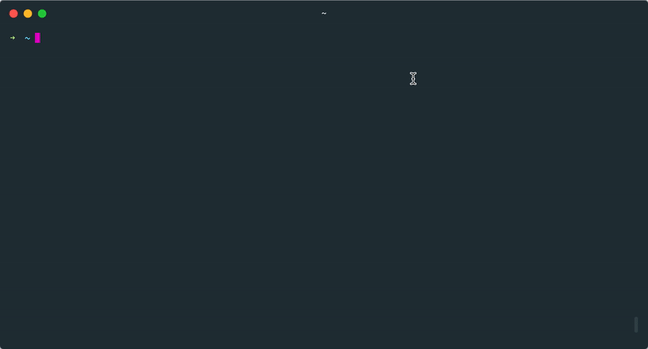

# [sh.abranhe.com](https://sh.abranhe.com)



Example installing the [os](https://github.com/abranhe/os) project.

```
$ curl https://sh.abranhe.now.sh/os -sSf | sh
```

## License

MIT © [Carlos Abraham](https://github.com/abranhe)